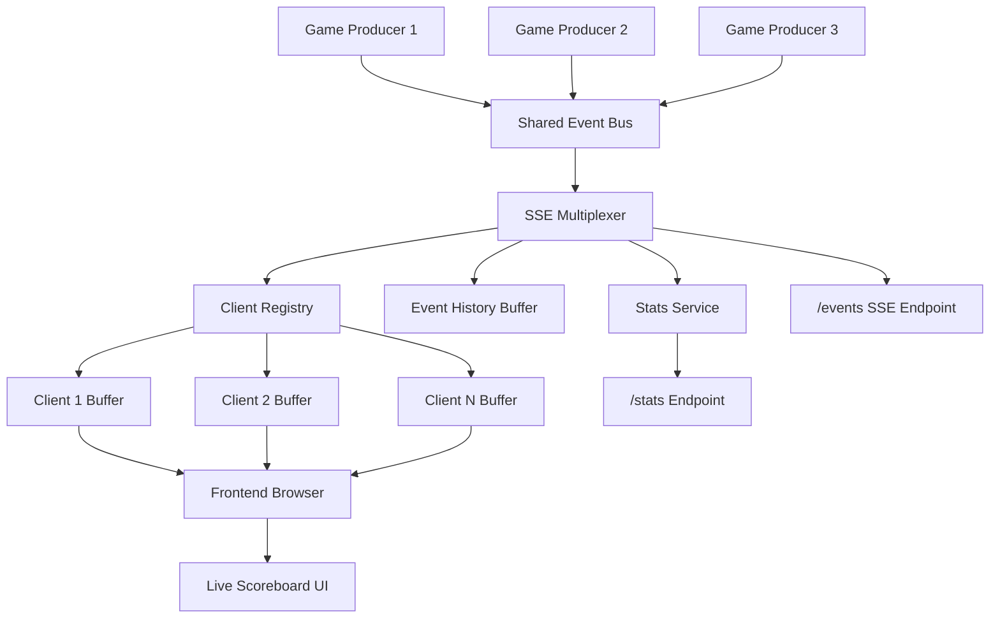

# Real-Time SSE Sports Score Feed Multiplexer

## Project Overview

This project is a **high-performance real-time sports score feed aggregator** built using **Express.js**, **Server-Sent Events (SSE)**, **Docker**, and **Docker Compose**.

The system simulates multiple live sports games and streams score updates to connected clients in real time using SSE. It supports multiple concurrent users, game-based subscriptions, heartbeat pings, event replay using `Last-Event-ID`, initial state synchronization, and slow-client backpressure handling.

This project is fully containerized and can be started using a single command:

```bash
docker-compose up --build
```

This ensures reliable automated evaluation and production-ready deployment behavior.

---

## Real-Life Scope

This architecture is widely used in real-world systems where **live one-way updates** are required from server to client.

### Examples of Real-World Applications

* Live Sports Score Platforms
* Stock Market Tickers
* Crypto Price Dashboards
* News Feed Systems
* Monitoring Dashboards
* Social Media Live Notifications
* Delivery Tracking Systems
* Flight Status Monitoring
* IoT Monitoring Systems
* Election Result Dashboards

Instead of continuously polling the server, the server pushes updates instantly to users using a persistent HTTP connection.

This improves:

* performance
* scalability
* latency
* user experience
* server efficiency

---

## Why Server-Sent Events (SSE)?

SSE is used instead of WebSockets because:

* communication is only server → client
* simpler implementation
* built on standard HTTP
* automatic reconnection support
* lightweight and reliable
* ideal for dashboards and live feeds

This makes SSE the perfect fit for score streaming systems.

---

## Core Features

### Backend Features

* `/events` SSE endpoint
* `/stats` monitoring endpoint
* game-specific subscription filtering
* `initial_state` on first connection
* `score_update` live streaming
* `Last-Event-ID` replay support
* heartbeat `: ping` every 15 seconds
* slow client backpressure handling
* dropped event tracking
* concurrent multi-game simulation
* Docker healthcheck support

### Frontend Features

* live scoreboard UI
* real-time score updates
* connection status indicator
* stats bar
* auto score flashing animation
* required `data-testid` attributes for evaluation
* EventSource API integration

---

## Tech Stack

### Backend

* Node.js
* Express.js
* Server-Sent Events (SSE)
* Native `crypto` module

### Frontend

* HTML
* CSS
* JavaScript
* EventSource API

### DevOps

* Docker
* Docker Compose

---

## Project Structure

```text
sse-sports-feed/
│
├── docker-compose.yml
├── .env.example
├── README.md
│
├── server/
│   ├── Dockerfile
│   ├── package.json
│   ├── app.js
│   │
│   ├── config/
│   │   └── constants.js
│   │
│   ├── models/
│   │   └── GameEvent.js
│   │
│   ├── services/
│   │   ├── producer.js
│   │   ├── clientRegistry.js
│   │   ├── eventHistory.js
│   │   └── statsService.js
│   │
│   ├── routes/
│   │   ├── events.js
│   │   └── stats.js
│   │
│   └── public/
│       ├── index.html
│       ├── script.js
│       └── styles.css
```

---

## System Architecture Diagram



---

## Request Flow

### Step 1

Game producers simulate live sports score updates every few seconds.

### Step 2

Generated events are pushed into the shared event system.

### Step 3

The SSE multiplexer receives these events.

### Step 4

Subscribed clients are identified using the client registry.

### Step 5

Events are sent only to relevant subscribed users.

### Step 6

Frontend receives events using EventSource and updates the UI instantly.

---

## Backpressure Handling

One slow client must never block fast clients.

### Solution Used

Each client gets:

* individual event queue
* buffer limit
* non-blocking send strategy

If a client becomes slow:

* event is dropped only for that client
* server continues serving others
* dropped events are counted in metrics

This prevents system-wide slowdown.

---

## Event Replay Support

The project supports:

```http
Last-Event-ID
```

When a client reconnects:

* server checks the last received event ID
* missed events are replayed
* live streaming resumes

This ensures no important updates are lost.

---

## API Endpoints

---

### GET `/events`

Main SSE endpoint for live score updates.

### Example

```http
GET /events?games=game-01,game-02
```

### Response Headers

```http
Content-Type: text/event-stream
Cache-Control: no-cache
Connection: keep-alive
```

### Event Types

* `initial_state`
* `score_update`

---

### GET `/stats`

Provides live system metrics.

### Example Response

```json
{
  "connected_clients": 2,
  "events_per_second": 0,
  "total_dropped_events": 0,
  "active_games": [
    {
      "game_id": "game-01",
      "last_update": "2026-04-29T05:00:00Z"
    }
  ]
}
```

---

## Installation & Run

### Step 1

Clone the repository

```bash
git clone <your-repo-url>
cd sse-sports-feed
```

---

### Step 2

Start the application

```bash
docker-compose up --build
```

This single command starts:

* backend service
* frontend UI
* producers
* healthcheck monitoring

---

## Access URLs

### Frontend

```text
http://localhost:8080
```

### Stats Endpoint

```text
http://localhost:8080/stats
```

### SSE Endpoint

```text
http://localhost:8080/events
```

---

## Automated Evaluation Ready

This project is designed specifically for automated evaluation.

### Included Requirements

* Docker Compose orchestration
* health checks
* `.env.example`
* SSE formatting compliance
* correct headers
* replay support
* frontend testability
* stable startup using one command

This ensures reliable evaluation success.

---

## Learning Outcomes

This project helps develop strong understanding of:

* real-time backend systems
* event-driven architecture
* concurrent client handling
* production-grade SSE design
* backpressure management
* event replay systems
* Dockerized deployment
* scalable backend architecture

These are highly valuable skills for backend engineering roles.

---

## Conclusion

This project demonstrates how to build a scalable, real-time event streaming system using modern backend engineering practices.

It goes beyond a simple CRUD project and reflects practical production patterns used in real-world companies for delivering live data at scale.
